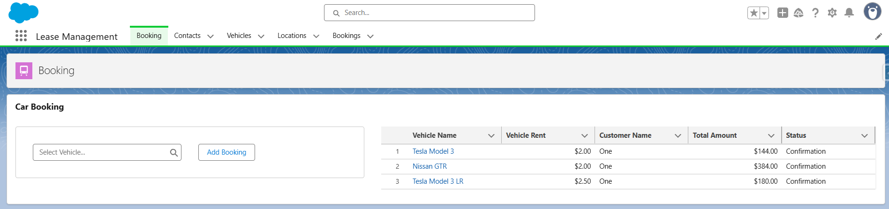
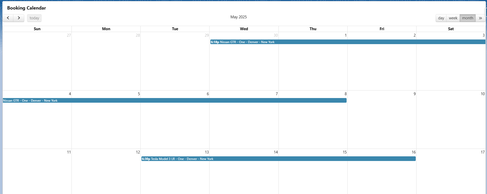

# Lightning Web Components (LWC) Overview




This Salesforce DX project includes several custom Lightning Web Components (LWC) to enhance the Booking application. Below is an overview of the main LWC components:

## Components

### 1. `addBooking`
- **Path:** [force-app/main/default/lwc/addBooking](force-app/main/default/lwc/addBooking)
- **Description:**  
  Provides a modal form for creating new Booking records. Utilizes `lightning-record-edit-form` and various `lightning-input-field` elements for user-friendly data entry.
- **Key Features:**
  - Modal dialog UI
  - Required fields for vehicle, customer, start/end datetime, locations, and status
  - Handles form submission and success events

### 2. `booking`
- **Path:** [force-app/main/default/lwc/booking](force-app/main/default/lwc/booking)
- **Description:**  
  Main component for displaying and managing bookings. Can be added to record, app, or home pages.
- **Key Features:**
  - Exposed to Lightning App Builder for flexible placement
  - Designed for integration with booking data

### 3. `bookingMap`
- **Path:** [force-app/main/default/lwc/bookingMap](force-app/main/default/lwc/bookingMap)
- **Description:**  
  Displays booking locations on a map interface. Useful for visualizing start and end locations of bookings.
- **Key Features:**
  - Map visualization of booking data
  - Exposed to Lightning App Builder

## Project Structure: `force-app` Folder

The `force-app` folder contains all the source code and metadata for your Salesforce application. Here’s an overview of what is typically included:

### 1. **Lightning Web Components (LWC)**
- **Location:** `force-app/main/default/lwc`
- **Description:**  
  Custom Lightning Web Components for the Booking application, such as `addBooking`, `booking`, and `bookingMap`.

### 2. **Apex Classes**
- **Location:** `force-app/main/default/classes`
- **Description:**  
  Server-side logic written in Apex to support business processes, data manipulation, and integration.

### 3. **Custom Objects**
- **Location:** `force-app/main/default/objects`
- **Description:**  
  Custom Salesforce objects (e.g., `Booking__c`, `Vehicle__c`, `Customer__c`) that define the data model for the application.

### 4. **Lightning Pages & Flexipages**
- **Location:** `force-app/main/default/flexipages`
- **Description:**  
  Custom Lightning App Builder pages for arranging components and layouts.

### 5. **Custom Tabs, Applications, and Profiles**
- **Locations:**  
  - Tabs: `force-app/main/default/tabs`  
  - Applications: `force-app/main/default/applications`  
  - Profiles/Permissions: `force-app/main/default/profiles`, `force-app/main/default/permissionsets`
- **Description:**  
  Custom navigation tabs, Salesforce apps, and user access controls.

### 6. **Other Metadata**
- **Examples:**  
  - Static Resources (`force-app/main/default/staticresources`)

---

**Note:**  
The actual contents of your `force-app` folder may vary depending on your project. You can explore each subfolder to see the specific metadata and code included in your Salesforce application.

## Deployment

To deploy only the LWC components:

```sh
sfdx force:source:deploy -p force-app/main/default/lwc
```

To deploy the complete `force-app` source (including Apex classes, objects, and all metadata):

```sh
sfdx force:source:deploy -p force-app
```

Or, to deploy everything in your default package directory:

```sh
sfdx force:source:deploy -p force-app/main/default
```

---

For more details, see the [Salesforce LWC documentation](https://developer.salesforce.com/docs/component-library/documentation/en/lwc).